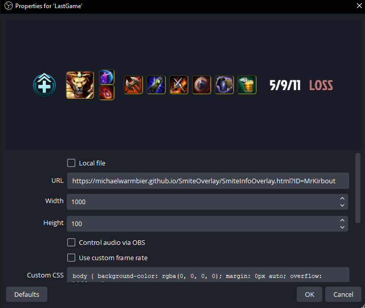

# SmiteOverlay
Twitch overlay for SMITE. Displays the last game played.

## How to Use

You can test out the widget at the following URL:

`https://michaelwarmbier.github.io/SmiteOverlay/SmiteInfoOverlay.html?ID=<YOUR_USER>`

###### Please note, users with their profile on PRIVATE may not be able to get accurate results. This is a limitation of the SMITE API.

Once you have confirmed your last match is updating correctly, go into your version of [Open Broadcast Software](https://obsproject.com) and create a new Browser Source. In the properties for the source, set the following:



Make sure:
- Width is set to **1000**
- Height is set to **100**
- the URL is set to the above **URL with your username**

## Updating the Display

You can use OBS' interact feature to refresh the page manually OR set the **Refresh browser when scene becomes active** property and switch scenes to update. Display will NOT update automatically upon finishing a game. Information is usually up to date during the VICTORY screen.

## Customization

To hide an element on the display, go to the **Custom CSS** section of the properties and add the following line with the name of the element you wish to remove:

```css
#<Name> { display: none !important; }
```

Element names:
- ITEMS
- ACTIVES
- GOD
- ROLE
- KDA
- Status

To change the background color, add the following line with the [hex color](https://www.google.com/search?client=opera-gx&q=hex+color+picker&sourceid=opera&ie=UTF-8&oe=UTF-8) you wish to use:

```css
#Content { background-color: #<color> !important; }
```

To hide the background entirely, add the following line:

```css
#Content { background-color: transparent !important; }
```

## Contribution & Contact

You can contribute directly or contact me using the links below with ideas/suggestions.

- [Official Discord Server](https://discord.gg/ZDUrzSXrKp)
- [My Twitter](https://twitter.com/MichaelWarmbier)
- [Donate](https://www.buymeacoffee.com/michaelwarmbier)


